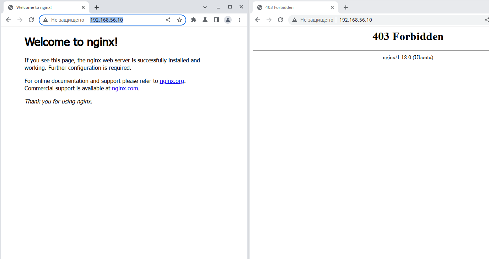

# Задание: Настраиваем центральный сервер для сбора логов


В Vagtant поднимаем 2 машины web и log
на web поднимаем nginx
на log настраиваем центральный лог сервер на любой системе на выбор
journald;
rsyslog;
elk.
настраиваем аудит, следящий за изменением конфигов нжинкса

---
## Решение:

Vagrant создаёт 2 виртуальные машины, после создания которых запускается ansible-playbook, свой для каждого хоста. Комментарии приведены в самих плейбуках.

```
[andrej@home-srv OTUS-Task16]$ vagrant status
==> vagrant: A new version of Vagrant is available: 2.4.1 (installed version: 2.2.19.dev)!
==> vagrant: To upgrade visit: https://www.vagrantup.com/downloads.html

Current machine states:

web                       running (virtualbox)
log                       running (virtualbox)

This environment represents multiple VMs. The VMs are all listed
above with their current state. For more information about a specific
VM, run `vagrant status NAME`.
[andrej@home-srv OTUS-Task16]$ 
```

До переноса страницы по умлочанию на хосте `web` писались только логи `/var/log/rsyslog/web/nginx_access.log`, после переноса страницы для того, чтобы получить ошибку, появились логи ` /var/log/rsyslog/web/nginx_error.log`
Результат сбора слогов на хосте `log`:
```
root@log:~# systemctl status rsyslog
● rsyslog.service - System Logging Service
     Loaded: loaded (/lib/systemd/system/rsyslog.service; enabled; vendor preset: enabled)
     Active: active (running) since Sun 2024-04-21 19:48:28 UTC; 2s ago
TriggeredBy: ● syslog.socket
       Docs: man:rsyslogd(8)
             man:rsyslog.conf(5)
             https://www.rsyslog.com/doc/
   Main PID: 2652 (rsyslogd)
      Tasks: 10 (limit: 2323)
     Memory: 1.4M
        CPU: 7ms
     CGroup: /system.slice/rsyslog.service
             └─2652 /usr/sbin/rsyslogd -n -iNONE

Apr 21 19:48:28 log systemd[1]: Starting System Logging Service...
Apr 21 19:48:28 log rsyslogd[2652]: warning: ~ action is deprecated, consider using the 'stop' statement instead [v8.2112.0 try https://www.rsyslog.com/e/2307 ]
Apr 21 19:48:28 log rsyslogd[2652]: imuxsock: Acquired UNIX socket '/run/systemd/journal/syslog' (fd 3) from systemd.  [v8.2112.0]
Apr 21 19:48:28 log rsyslogd[2652]: rsyslogd's groupid changed to 111
Apr 21 19:48:28 log rsyslogd[2652]: rsyslogd's userid changed to 104
Apr 21 19:48:28 log rsyslogd[2652]: [origin software="rsyslogd" swVersion="8.2112.0" x-pid="2652" x-info="https://www.rsyslog.com"] start
Apr 21 19:48:28 log systemd[1]: Started System Logging Service.
root@log:~# cat /var/log/rsyslog/web/nginx_access.log 
Apr 21 19:48:41 web nginx_access: 192.168.56.1 - - [21/Apr/2024:19:48:41 +0000] "GET / HTTP/1.1" 304 0 "-" "Mozilla/5.0 (X11; Linux x86_64) AppleWebKit/537.36 (KHTML, like Gecko) Chrome/108.0.0.0 YaBrowser/23.1.1.1114 Yowser/2.5 Safari/537.36"
Apr 21 19:48:41 web nginx_access: 192.168.56.1 - - [21/Apr/2024:19:48:41 +0000] "GET / HTTP/1.1" 304 0 "-" "Mozilla/5.0 (X11; Linux x86_64) AppleWebKit/537.36 (KHTML, like Gecko) Chrome/108.0.0.0 YaBrowser/23.1.1.1114 Yowser/2.5 Safari/537.36"
Apr 21 19:48:42 web nginx_access: 192.168.56.1 - - [21/Apr/2024:19:48:42 +0000] "GET / HTTP/1.1" 304 0 "-" "Mozilla/5.0 (X11; Linux x86_64) AppleWebKit/537.36 (KHTML, like Gecko) Chrome/108.0.0.0 YaBrowser/23.1.1.1114 Yowser/2.5 Safari/537.36"
Apr 21 19:48:46 web nginx_access: 192.168.56.1 - - [21/Apr/2024:19:48:46 +0000] "GET / HTTP/1.1" 304 0 "-" "Mozilla/5.0 (X11; Linux x86_64) AppleWebKit/537.36 (KHTML, like Gecko) Chrome/108.0.0.0 YaBrowser/23.1.1.1114 Yowser/2.5 Safari/537.36"
root@log:~# cat /var/log/rsyslog/web/nginx_access.log 
Apr 21 19:48:41 web nginx_access: 192.168.56.1 - - [21/Apr/2024:19:48:41 +0000] "GET / HTTP/1.1" 304 0 "-" "Mozilla/5.0 (X11; Linux x86_64) AppleWebKit/537.36 (KHTML, like Gecko) Chrome/108.0.0.0 YaBrowser/23.1.1.1114 Yowser/2.5 Safari/537.36"
Apr 21 19:48:41 web nginx_access: 192.168.56.1 - - [21/Apr/2024:19:48:41 +0000] "GET / HTTP/1.1" 304 0 "-" "Mozilla/5.0 (X11; Linux x86_64) AppleWebKit/537.36 (KHTML, like Gecko) Chrome/108.0.0.0 YaBrowser/23.1.1.1114 Yowser/2.5 Safari/537.36"
Apr 21 19:48:42 web nginx_access: 192.168.56.1 - - [21/Apr/2024:19:48:42 +0000] "GET / HTTP/1.1" 304 0 "-" "Mozilla/5.0 (X11; Linux x86_64) AppleWebKit/537.36 (KHTML, like Gecko) Chrome/108.0.0.0 YaBrowser/23.1.1.1114 Yowser/2.5 Safari/537.36"
Apr 21 19:48:46 web nginx_access: 192.168.56.1 - - [21/Apr/2024:19:48:46 +0000] "GET / HTTP/1.1" 304 0 "-" "Mozilla/5.0 (X11; Linux x86_64) AppleWebKit/537.36 (KHTML, like Gecko) Chrome/108.0.0.0 YaBrowser/23.1.1.1114 Yowser/2.5 Safari/537.36"
Apr 21 19:49:31 web nginx_access: 192.168.56.1 - - [21/Apr/2024:19:49:31 +0000] "GET /favicon.ico HTTP/1.1" 404 197 "-" "Mozilla/5.0 (X11; Linux x86_64) AppleWebKit/537.36 (KHTML, like Gecko) Chrome/108.0.0.0 YaBrowser/23.1.1.1114 Yowser/2.5 Safari/537.36"
Apr 21 19:49:35 web nginx_access: 192.168.56.1 - - [21/Apr/2024:19:49:35 +0000] "GET /100 HTTP/1.1" 404 197 "-" "Mozilla/5.0 (X11; Linux x86_64) AppleWebKit/537.36 (KHTML, like Gecko) Chrome/108.0.0.0 YaBrowser/23.1.1.1114 Yowser/2.5 Safari/537.36"
root@log:~# cat /var/log/rsyslog/web/nginx_error.log 
cat: /var/log/rsyslog/web/nginx_error.log: No such file or directory
root@log:~# cat /var/log/rsyslog/web/nginx_error.log 
Apr 21 19:50:21 web nginx_error: 2024/04/21 19:50:21 [error] 3477#3477: *3 directory index of "/var/www/html/" is forbidden, client: 192.168.56.1, server: _, request: "GET / HTTP/1.1", host: "192.168.56.10"
Apr 21 19:50:22 web nginx_error: 2024/04/21 19:50:22 [error] 3477#3477: *3 directory index of "/var/www/html/" is forbidden, client: 192.168.56.1, server: _, request: "GET / HTTP/1.1", host: "192.168.56.10"
root@log:~# 
```

